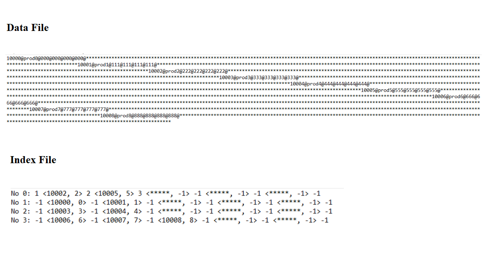

# Data management using B-Tree

## What it does?
This work aims to present a possible application of the B-Tree data structure in the organization and manipulation of data in a hypothetical product catalog. The program that was written in C language synchronizes the data file, which represents the catalog, and the index file that refers to the representation of the catalog in B-Tree format.

## Description
The purpose of the program is to synchronize the data file and the index file, thus making it possible, at the end of an execution, to have the current representation of the catalog with the information of each product (data file) and its representation in B-Tree format (index file) where each record (product) is represented by a primary key and its index in the data file. In the present work, a B-tree was used with a maximum of 5 keys per node.

### The Data File
The structure of a record (product) in the index file respects the following format:
- Each record occupies 192B and is composed of 6 pieces of information: primary key, brand, description, year of manufacture and price.
- A character '@' is placed at the end of each piece of information. The primary key has a fixed size of 5B, the year has a fixed size of 4B, the characters '@' occupy 6B, the other information has variable sizes, of so that the total size of the record never exceeds 192B, that is, the sum of the sizes of the brand, description, and price must have a maximum of 177B.
- If the sum of the information sizes and the '@' characters do not fill 192B, '*' characters are used to complete the record. The deletion of a record (product) is done in such a way that the first character of the record is replaced by '#'. For example, if a record has: key = 5B / name = 20B / brand = 20B / description = 110B / year = 4B / price = 5B, we would have:
    - Registration:
     $$ key@name@brand@description-@year@price@***************** *****$$

### The Index File
- The index file consists of the representation of the tree B that represents the catalog, it is built through traversal at the tree level, so that each line of the file represents a node and all its keys. Before and after each node key there is a reference to some child node.
- If the key does not exist, it is represented as <*****, -1> and if there is no reference to a child, it is represented by -1. 
- Example of the first line (root) of an index file:
    - Node 0: 
     $$1<10005, 5>2<10008, 8>3<*****, -1>-1<*****, -1>-1<*****,-1>-1$$
- In order to get the tree from the index file just parse each line and the child references.

### Example



### How to run?
- Clone the Repository
    ```bash
    git clone https://github.com/alexandreclem/BTreeDataManagement.git
    ```
- In the source_code direcotory, run:
    ```bash
    gcc work.c -o work
    ```
- In windows operating system you must execute the *.exe* file:
    ```bash
    work.exe prod.dat ibtree.idx
    ```
- In unix-based systems you must execute:
    ```bash
    ./work prod.dat ibtree.idx
    ```
